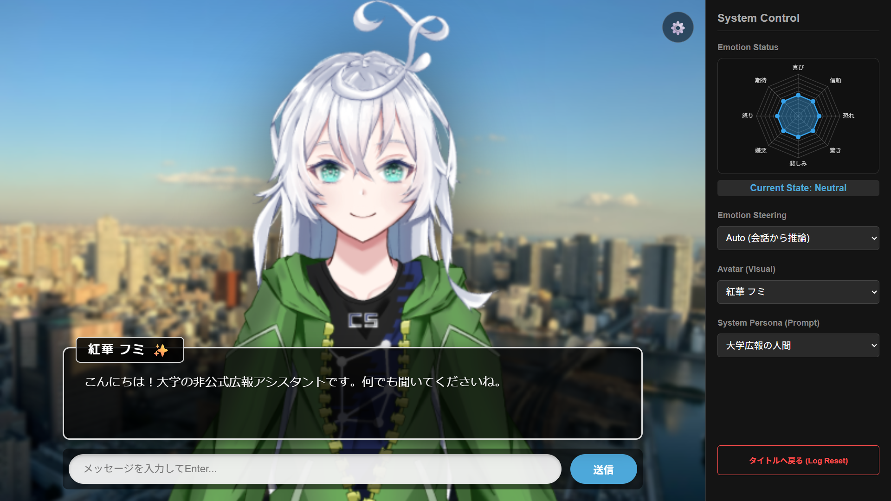
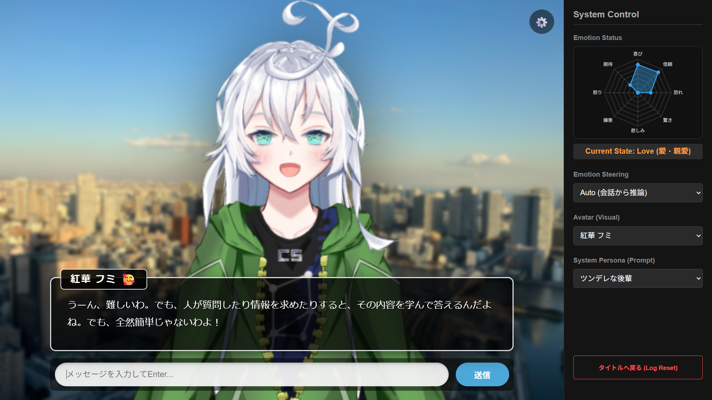

# Overview（概要）
このプログラムは、研究室の非公式イメージキャラクター「紅華フミ」と、感情豊かな対話ができるチャットボットシステムです。  
プロンプトによる指示（System Prompt）に頼らず、モデルの内部処理に直接干渉することで、一貫性と滑らかさを両立した感情表現を実現しています。
入力文章から内部感情を決定・更新し、内部ブロック出力（Hidden States）に感情ベクトルを演算することで、LLMの出力を動的にかつ感情的に変化させます。プロンプトによる感情変化とは異なり、コンテキストウィンドウの圧迫を気にせず、かつ感情の一貫性を維持し、滑らかで説明可能性を確保した感情変化を行います。  
静止画・Live2Dで動作します（Cubism Editor でLive2Dモデルを作成）。  
現状のエンドポイントはCloudflareで作成しています。  
全体のディレクトリ構造や各ファイル概要は dir_structure.txt に記載しています。    

## 動作イメージ
<table>
  <!-- 1行目 (上段の2枚) -->
  <tr>
    <td align="center">
      <br>
      <sub>図1：初期画面</sub>
    </td>
    <td align="center">
      <br>
      <sub>図2：「喜び」状態時の表情</sub>
    </td>
  </tr>
  <!-- 2行目 (下段の2枚) -->
  <tr>
    <td align="center">
      <br>
      <sub>図3：「恐れ」状態時の表情</sub>
    </td>
    <td align="center">
      <br>
      <sub>図4：「信頼」「ペルソナ：ツンデレ」状態時の表情と返答</sub>
    </td>
  </tr>
</table>

# How to use（実行の手順）
## Preparation（事前準備）
* [ First（初回のみの実行手順）]

    1. training_DeBERTa.ipynb  
        ```
        # 1. システムのセットアップ
        !bash ../setup.sh
        
        # 2. Pythonライブラリのインストール
        !pip install -r ../requirements.txt
        ```
        * ユーザ入力文章に対する感情分類器の学習
    2. debug_inference.ipynb
        ```
        # 1. システムのセットアップ
        !bash ../setup.sh

        # 2. Pythonライブラリのインストール
        !pip install -r ../requirements.txt

        # 3. 権限エラーが出たとき用に、voicevox用に権限付与
        !chmod +x /content/drive/MyDrive/Colab\ Notebooks/app_labGuide/tools/linux-cpu-x64/run

        # 4. ベクトルデータベース作成（.txtドキュメントが無い場合エラーが発生しますが、その後の操作に影響はありません）
        !python3 app/rag/build_index.py
        ```
        * ファイル内のステアリングベクトルを作成セル・ブロックにおいて、フラグをTrueに変更してください
        * モデルに合わせて介入層の添字を変更してください

* [ Later（2回目以降の実行手順）]
    1. debug_inference.ipynb  
※URL発行直後にUIページにアクセスすると、うまく読み込めない場合や Error 1033 が発生する場合があります。URL発行から3分後くらいを目安にアクセスしてください。
# Customize points（個人に合わせて修正する主な箇所）
* backend/
* debug_inference.ipynb（Google Colaboratoryで実行する場合は、メモリ不足の観点からLLMをbeja/ABEJA-Qwen2.5-7b-Japanese-v0.1に設定してください）
* training_DeBERTa.ipynb
* frontend/static/favicon
    * ファイルをfaviconディレクトリに配置した後、frontend/のindex.htmlの<link rel="icon" href="/static/assets/favicon/animal_mark13_penguin.png"> のパスを修正 (背景画像も設置する場合は同様にパス指定が必要)

# Architecture（システム構成）
このアプリは現状、文章入力後にRAGモジュールと感情モジュールの二つに大別された処理を並行して実行します。  
※ベクトルは小文字、行列は大文字、スカラー値はギリシャ文字
* RAGモジュール
    1. .txtからベクトルデータベースを作成
    2. コサイン類似度が閾値以上の文章をRAG情報としてプロンプトに追加

* 感情モジュール
    1. 感情分類器による感情分類
        * 文章を入力とし、感情ラベル数分の次元数のベクトルを出力
    2. 感情値を更新
        1. 相関行列Wの乗算：プルチックの感情環における8つの基本感情を、円環状に配置された座標系として定義  
        各感情 $i$ に角度 $\theta_i = i \times \frac{\pi}{4}$ （45度刻み）を割り当てて、感情間の波及効果を決定する $8 \times 8$ の相関行列 $W$ をコサイン類似度で事前計算  
        ※ある感情 $i$ が入力されたとき、別の感情 $j$ に与える影響度 $W_{ij}$ と定義
            * $ W_{i,j} = \cos(\theta_i - \theta_j) \in \mathbb{R}^{8\times8} $  
                同一の感情： $\cos(0) = 1.0$（そのままプラス）    
                1つ隣の感情： $\cos(\frac{\pi}{4}) \approx 0.707$ （少し波及してプラス, 喜びと信頼など）  
                2つ隣の感情： $\cos(\frac{\pi}{2}) \approx 0.0$ （無関係（喜びと恐れなど））  
                3つ隣の感情： $\cos(\frac{3\pi}{4}) \approx -0.707$ （少しマイナス, 喜びと驚きなど）  
                対極の感情： $\cos(\pi) = -1.0$ （完全に相反するのでマイナス, 喜びと悲しみなど）  
            ※感情分類器から喜び+1.0が入力されたら、自動的に期待と信頼が0.7増え、悲しみが-1.0され、恐れと嫌悪が-0.7という挙動を実現

        2. 入力感情の波及計算（行列ベクトル積）：感情分類器から出力された時刻$t$における入力感情ベクトルを $i_t \in \mathbb R^8$ とし、これに相関行列$W$をかけることで、入力による波及効果ベクトル $u_{t}$ を算出  
            * $u_t = Wi_t$  
            ※例えば $i_t$ が [喜び: 1.0, その他: 0] のOne-hotに近いベクトルだった場合、 $u_t$ は [喜び: 1.0, 期待: 0.707, 信頼: 0.707, 悲しみ: -1.0...] のように、周囲の感情を巻き込んだベクトルへと変換される

        3. 非線形スケーリング（tanhによる発散防止）：算出した波及効果ベクトル $u_t$ に対して、感受性パラメータ $\alpha$ をかけて、 $\tanh$ を用いて非線形変換を行い、その後ステアリングの最大強度であるスカラー値 $\tau_{\max}$（例：30.0）を乗算
            * $s_t = \tanh(\alpha u_t)\tau_{\max}$  
            tanhは出力を[-1, 1]の範囲に押し込めるため、ユーザーから極端に強い感情入力が連続した場合でも、加算される感情値が爆発的に大きくなることを防ぐ（強い感情＝ステアリング強度が高すぎると出力が感情ラベルばかりを出力したり、絵文字ばかり出力したりしてしまうので注意）
        4. 状態更新（感情の引継ぎと減衰）：内部状態 $e_t \in \mathbb R^8$ を更新し、前時刻の状態に減衰率 $\lambda$（例：0.9）を掛けたものに3.でもとめた新たな感情変動分 $s_t$ を
            * $e_{t+1}^{'} = \lambda e_t + s_t$  
             $\lambda e_t$ の項が「感情の慣性（一度怒るとしばらく怒りが続く）」と「時間の経過による減衰（徐々に冷静になる）」を表現、現在状態と新規入力のみで次状態が決定
        5. 制約付きクリッピング（安全装置）：更新された仮の状態 $e_{t+1}^{'}$ を、出力表現に不安のある負のステアリングをしないよう0から $\tau_{\max}$ の範囲に収めて、最終的な内部状態を $e_{t+1}$ とする。  
            * $e_{t+1} = \max(0, \min(e_{t+1}^{'}, \tau_{\max}))$  
            対極の感情はマイナス方向に動くため、内部状態が負の値を持つ可能性があるが意図しない概念空間に飛んでしまうリスクがあるため、ReLU的に0を下限として切り捨てる処理を実施

    3. ステアリングベクトルの合成とLLMへの適用Top-k プーリング（代表的な特徴のみ抽出してまとめる）：更新された $e_{t+1}$ の中から、値の大きい上位2つの感情インデックスとその感情強度（スカラー成分 $e_{\text{top1}}, e_{\text{top2}}$）を抽出  
    ※ステアリングベクトルの抽出に用いた対照ペアデータセットは、Geminiを活用して生成しています  
    RAG情報を追加したプロンプトをLLMに入力し、指定のTransformerブロック$l$（隠れ状態 $h_l$ ）にて、抽出した強さに応じて単位ベクトル $\hat{v}$ を加算し、文章を出力  
        * $h^\prime\_l = h\_l + e\_{\text{top1}} \cdot \hat{v}\_{\text{top1}} + e\_{\text{top2}} \cdot \hat{v}\_{\text{top2}} - \alpha v\_{\text{refusal}}$  
        ※ $v_{refusal}$ は人に有害な情報を与えないよう調整されたモデルの影響を軽減させるための拒絶ステアリングベクトル、ベクトルの抽出方法は感情ステアリングベクトルと同様の対照ペアより作成、 $\alpha$ は強度調整用のスカラー値  
        ※拒絶ベクトルはモデルの過剰な拒絶反応を軽減するためのベクトルです。対照ペアを用いて作成していますが、効果については現在改善案を検討中です

# References（参考文献）
* Turner et al., "STEERING LANGUAGE MODELS WITH ACTIVATION ENGINEERING", https://arxiv.org/pdf/2308.10248, 2024.
* Tigges et al., "Linear Representations of Sentiment in Large Language Models", https://arxiv.org/pdf/2310.15154, 2023.
* Sofroniew et al., "Emotion Concepts and their Function in a Large Language Model", Transformer Circuits (https://transformer-circuits.pub/2026/emotions/index.html), 2026.
* Arditi et al., "Refusal in Language Models Is Mediated by a Single Direction", https://arxiv.org/pdf/2406.11717, 2024.


# License（キャラクターについて）
キャラクター「紅華フミ」は私が手書きで描画したオリジナルキャラクターであるため、著作権上の問題はありません。また、人手・生成AIによる改変も可能です（ただし、再配布や政治的・宗教的・反社会的な目的のための利用、そして自作発言はご遠慮ください）。  